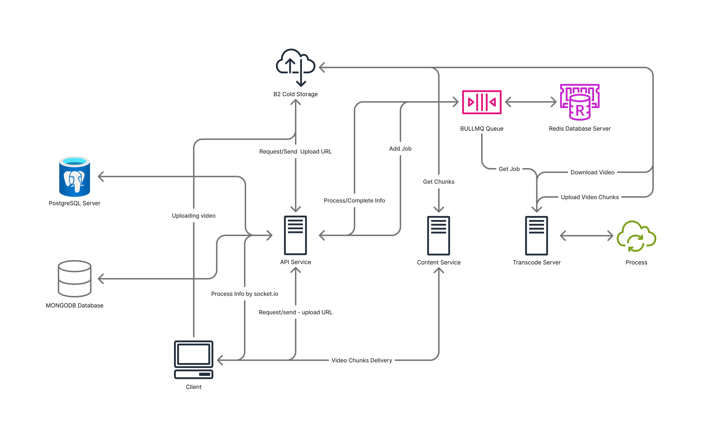

# Streamlet: Microservices-Based Video Streaming Platform

Streamlet is a modern, scalable video streaming platform built from the ground up using a microservices architecture. It efficiently handles the entire video lifecycle—from upload and multi-resolution transcoding to on-demand, high-performance streaming.

## 

### Frontend (Nextjs and tailwind CSS) : https://github.com/rahulkbharti/streamlet-frontend.git

## Architecture Overview

Streamlet consists of three core, decoupled microservices that communicate via a job queue. This design ensures each part of the system can be scaled, updated, and maintained independently.

**Workflow:**

1. **Upload:** Client requests an upload URL from the API Service.
2. **Storage:** Video is uploaded directly to cloud object storage (e.g., B2 Cold Storage).
3. **Processing Job:** API Service adds a new transcoding job to the BULLMQ queue.
4. **Transcoding:** Transcoder Service picks up the job, downloads the video, transcodes it into multiple formats (1080p, 720p, 480p), and uploads processed chunks back to storage.
5. **Streaming:** Content Service delivers the appropriate video chunks to the client for smooth playback.

---

## Core Components

### 1. API Service

- **Role:** Central gateway to the platform.
- **Responsibilities:**
  - Manages client interactions
  - User authentication
  - Handles video metadata (PostgreSQL & MongoDB)
  - Orchestrates upload process
  - Adds jobs to transcoding queue
- **Technologies:** Node.js, Express, PostgreSQL, MongoDB, Socket.io

### 2. Transcoder Service

- **Role:** Dedicated background worker for video processing.
- **Responsibilities:**
  - Listens for new jobs from BULLMQ
  - Downloads source video
  - Transcodes using FFmpeg
  - Uploads processed chunks to storage
- **Technologies:** Node.js, BULLMQ, FFmpeg, Redis

### 3. Content Service

- **Role:** High-performance delivery engine.
- **Responsibilities:**
  - Delivers video chunks (HLS/DASH) and images to clients
- **Technologies:** Node.js, NGINX (optional for caching/proxying. Also can be contected with CDN)

---

## Technology Stack

- **Backend:** Node.js
- **Databases:** PostgreSQL (relational), MongoDB (document)
- **Job Queue:** BULLMQ with Redis
- **Real-time Communication:** Socket.io
- **Object Storage:** Backblaze B2 (or any S3-compatible service)
- **Containerization:** Docker (recommended)

---

## Key Features

- **Microservices Architecture:** Scalability, fault tolerance, maintainability
- **Asynchronous Video Processing:** Non-blocking transcoding
- **Multi-Resolution Streaming:** Adaptive Bitrate Streaming
- **Real-time Upload Progress:** Live updates via Socket.io
- **Decoupled Components:** Independent development and deployment

---

## Test Scenarios & Analysis

Two separate tests were run to determine both the stable performance and the absolute limit of the infrastructure.

### Test 1: Baseline Load (150 Max VUs)

This test simulated a heavy load of 150 concurrent users.

- **Result:** `✓ COMPLETE SUCCESS`
- **Analysis:** The application passed all thresholds with excellent performance. P95 latency for both endpoints was `~1 second`, well below the 2-second goal. Reliability was 100%.

| Metric (150 VUs) | `getVideo` p(95) | `getVideos` p(95) | `http_req_failed` |
| :--------------- | :--------------- | :---------------- | :---------------- |
| **Result**       | `1.03s`          | `1.00s`           | `0.00%`           |
| **Threshold**    | `✓ PASSED`       | `✓ PASSED`        | `✓ PASSED`        |

### Test 2: Stress Test (200 Max VUs)

After the success of the 150 VU test, the load was increased to 200 VUs to find the system's bottleneck.

- **Result:** `✓ BOTTLENECK IDENTIFIED`
- **Analysis:** The system remained 100% reliable (`0.00%` errors), but performance degraded. Latency doubled, and the `getVideo` endpoint failed its 2-second P95 goal.

| Metric (200 VUs) | `getVideo` p(95) | `getVideos` p(95) | `http_req_failed` |
| :--------------- | :--------------- | :---------------- | :---------------- |
| **Result**       | `2.06s`          | `1.99s`           | `0.00%`           |
| **Threshold**    | `✗ FAILED`       | `✓ PASSED`        | `✓ PASSED`        |

---

## 3. Conclusion

- **Sweet Spot:** The application runs perfectly at 150 concurrent users with 1-second response times.
- **Bottleneck:** The performance limit for the 0.25 vCPU containers is between 150-200 users. At this load, CPU saturation causes latency to double.
- **Databases:** In both tests, Neon Postgres and MongoDB were stable and not the bottleneck.
- **Actionable Insight:** The system is 100% stable. To serve over 150 users at peak performance, the container's vCPU (compute) resources should be vertically scaled.

## 4. Full k6 Output

For detailed test results and logs, refer to the `test` folders within each service directory.

## Getting Started

Follow these steps to set up the project locally:

```bash
git clone https://github.com/rahukbharti/streamlet-microservices.git
cd streamlet-microservices
# Make Sure that You have create the environment files for each service
docker-compose up -d # Or Run each service individually
```

1. Set up environment variables (add `.env.development` and `.env.production` files in each service folder)
2. Start each service (API, Transcoder, Content) as described in their respective folders
